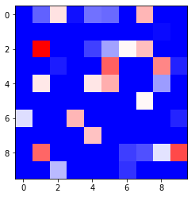
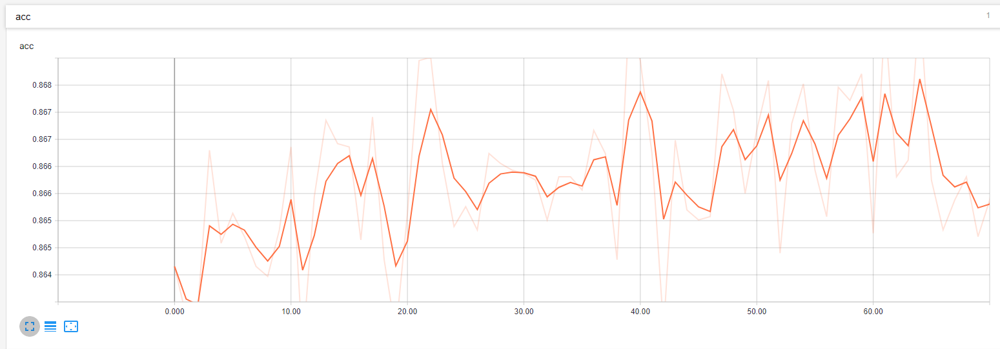
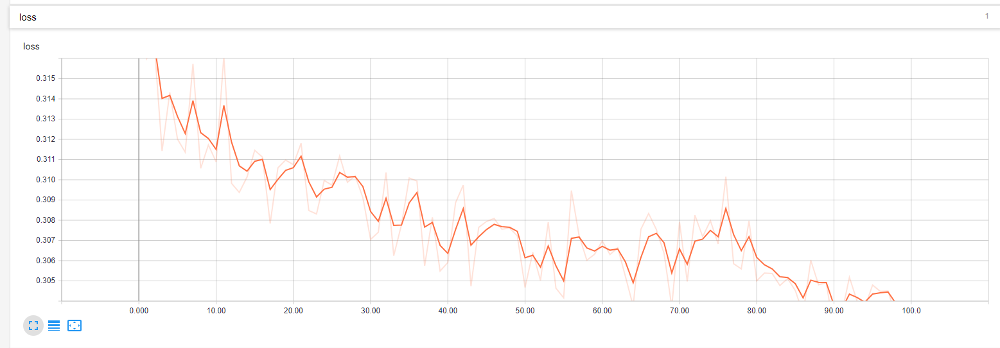
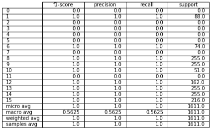
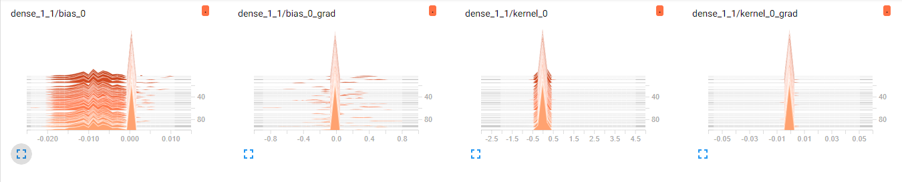
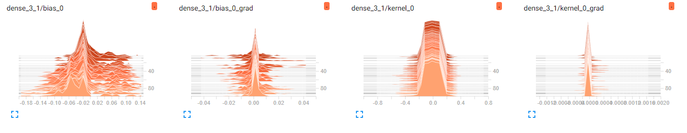
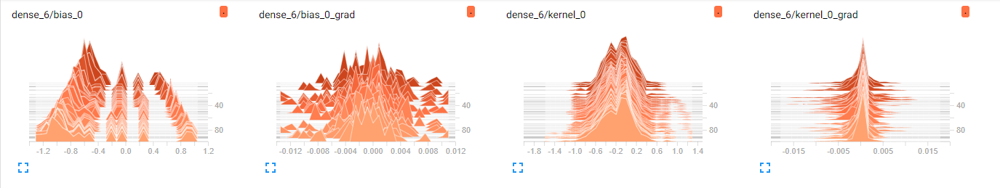

# Job Tag Classifier - (Semi-Supervised Learning)

We take a job title and a job description and predict the tags associated with that job. We do this through Natural Language Processing (NLP), a Convolutional Autoencoder (AE), and a Deep Neural Network (DNN). This model will train itself to become more accurate as more jobs are added by training it when new data is added. The model uses feature hashing which allows it to learn new words in the job descriptions. Here is the pipeline used:

# Data Collection

The data is scrapped from various job posting sites. Our data is manually tagged with each tag for each job having its own line. Since this creates lots of duplicate rows, we must handle this in our feature processing step. Here is a is an example of the data:

# Feature Creation & Feature Processing

After we grab the data from our SQL database, we convert it into a pandas dataframe before creating our features and turning the text into numerical data. We perform feature creation by generating text features, part of speech features, and finally collect all the job tags for each job id to remove duplicate rows. We are now ready for feature processing. We try to reduce the number of words and therefore the number of variables for input into our model by reducing words down to their root form. We do this through cleaning, stripping, and stemming. We then use feature hashing so our input space can recognize new words it has not seen. We then add all the features we created and the text data into one dataframe and send it to our model.

# The Model

We first trained an autoencoder (AE) to reduce the dimensionality of our data from 32k to 100 columns. We do this through training a convolutional AE with 4 convolution/pooling steps and 3 hidden layers that is symmetric around the center of the network. The input to the network is the same as the output of the network. This way our network is trained to learn a representation of the data. This essentially compresses the data with some losses. We accept those losses as we are able to use a lot less computing power because of our dimensionality reduction. After we train the autoencoder on our dataset we can then cut off the decoder and use the encoder as the first step in our model. The following is a simplified representation of autoencoding.

Our model then uses a deep neural network (DNN) with 5 hidden layers [Input->200->150->100->50->25->Output]. We use Rectified Linear Units ('relu') for the activation of each hidden layers and apply a dropout. Our output layer has 16 classes with sigmoid activation. We then threshold the output to provide 0 or 1 for each tag. The following is a simplified representation of our DNN.

# Updating the Model

After we have seen enough data go through the predict tag function, we use all the new jobs we saw to train the classifier again. We load the weights of the model and update them by fitting the new data. Since we are using fixed size feature hashing, we are able to learn unseen words and use them as variables in the model.

# The Performance

    Our autoencoder compressed our job description to 100 feature representation. We can visualize them with a heatmap.    
    <aside>
        
    </aside>

 After encoding the descriptions, we send the data into the deep neural network. We scored an 86% accuracy on both the training and testing set. We can visualize accuracy and loss during training in tensorboard.

One thing our dataset had was unbalanced classes. Some classes had 200 examples while others had only a handful. This led to many classes having zero precession. Finding more data would improve our scores but here is the per class classification report.

Finally let’s see how our model developed over each layer be representing weights of the first, third and sixth dense layers as a histogram.

# Conclusion

Overall the model was successfully able to predict job tag at 85% accuracy. While a success metric was never set to make this a viable product 85% is a great starting point for a relatively small dataset. With more time and computing power, and a balanced dataset accuracy and per class precision could increase.
