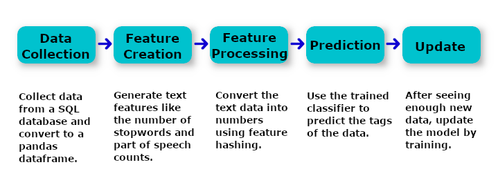
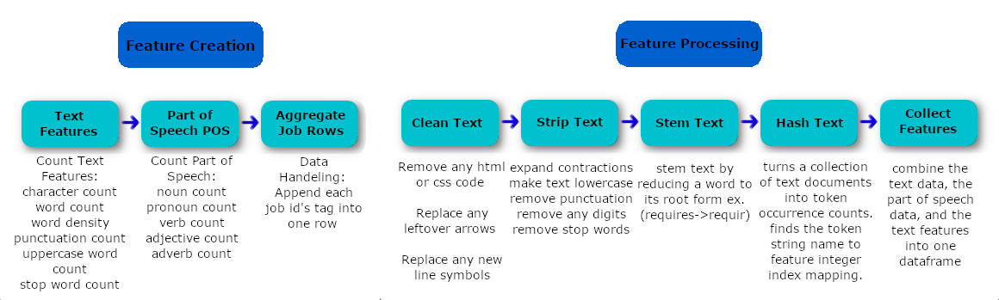
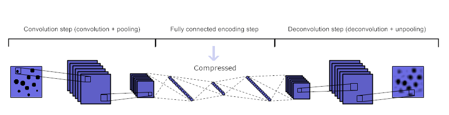
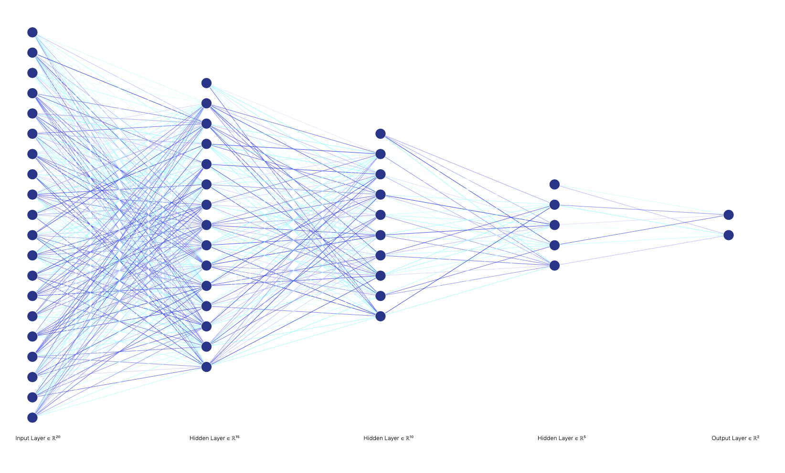
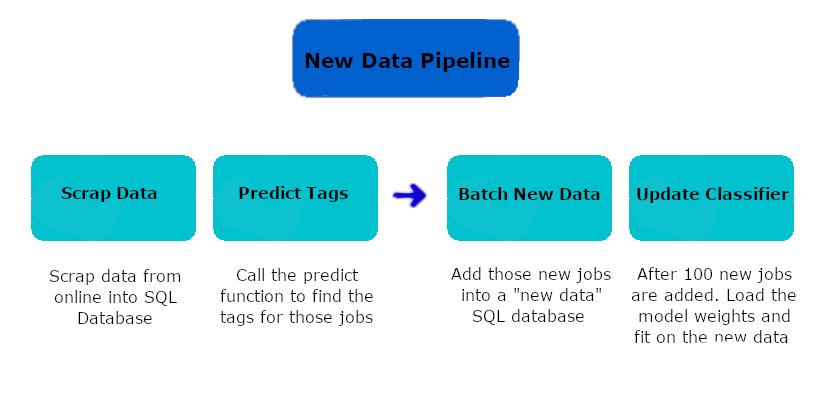

# Job Tag Classifier - (Semi-Supervised Learning)
We take a job title and description and predict the tags associated with that job. We do this through Natural Language Processing (NLP), a Convolutional Autoencoder (AE), and a Deep Neural Network (DNN). This model will train itself to become more accurate as more jobs are added by training it when new data is added. The model uses feature hashing which allows it to learn new words in the input space. Here is the pipeline used:

# Data Collection

Our data is manually tagged with each tag for each job having its own line. Since this crates lots of duplicate rows we must handle this in our feature processing step. Here is a is an example of the data:

# Feature Creation & Feature Processing

After we grab the data from our SQL database, we convert it into a pandas dataframe before creating our features and turning the text into numerical data. We perform feature creation by generating text features, part of speech features, and finally collect all the job tags for each job id to remove duplicate rows. We are now ready for feature processing. We try to reduce the number of words and therefore the number of variables for input into our model by reducing words down to their root form. We do this through cleaning, stripping, and stemming. We then use feature hashing so our input space can recognize new words it has not seen. We then add all the features we created and the text data into one dataframe and send it to our model.

# The Model

We first trained an autoencoder (AE) to further reduce dimensionality of our variables from 32k to 100. We do this through training a convolutional AE with 3 hidden layers that is symmetrically around the center of the network. The input to the network is the same as the output of the network. This way our network is then trained to learn a latent space representation of the data essentially compressing the data with some losses. We accept those losses as we are able to use a lot less computing power because of our dimensionality reduction. After we train the autoencoder on our dataset we can then cut off the decoder and use the encoder as the first step in our model.

Our model then uses a simple deep neural network with 5 hidden layers. We use Rectified Linear Units for activation of the hidden layers with dropout. Our output layer has a sigmoid activation which is then thresholded to provide 0 or 1 for each tag.

# Updating the Model

After we have seen enough data go through the predict tag function we use all the new jobs we saw to train the classifier again. We load the weights of the model and update them by fitting the new data. Since we are using fixed size feature hashing we are able to learn unseen words and use them as variables in the model.

# The Performance

